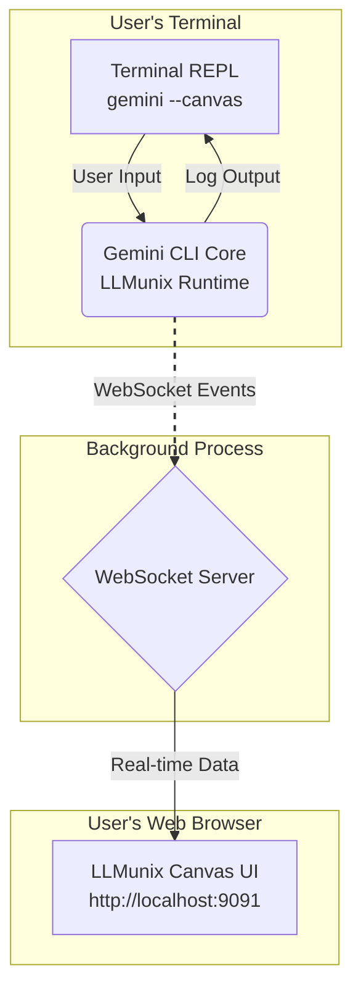

### **The "LLMunix Canvas" - A Minimal Viable UI**

#### **1. Core Principle: Augment, Don't Replace**

Instead of building a full-blown replacement for the Gemini CLI, the "LLMunix Canvas" will act as a **visual companion** or **debugger**. The user will still interact with the standard Gemini CLI in their terminal for input, confirmations, and seeing the live log. The UI will launch alongside it, providing a real-time, graphical representation of the high-level concepts that are difficult to track in a terminal.

This approach dramatically reduces initial development complexity and leverages the existing, robust CLI for what it does best.

#### **2. Architecture: Headless Data Provider + Visualizer**

The architecture remains a client-server model, but its purpose is simplified.

*   **`gemini-cli --canvas`:** This new flag starts the normal Gemini CLI REPL in the terminal. **In addition**, it spawns a lightweight WebSocket server in the background. This server's only job is to broadcast structured events about the agent's state.
*   **Web-based "Canvas":** The user opens `http://localhost:9091` in a browser. This page connects to the WebSocket and acts as a pure visualizer. It does not send commands back to the CLI; it only receives and displays data.



#### **3. The Minimal UI: Three Core Visual Panels**

The UI will be a single-page application with three main, resizable panels, focusing entirely on visualizing the unique state of the `LLMunix` OS.

##### **Panel 1: The Workspace & Component Canvas (The "File System")**

This panel shows the "physical" layout of the `LLMunix` project, answering the user's need to "see the list of documents that are part of the work".

*   **View:** A clean, icon-driven file tree.
*   **Folders:** Top-level folders are `components`, `system`, and `workspace`.
*   **Icons:** Use distinct icons for different file types:
    *   `🤖` for Agents (`.md` files in `components/agents/`)
    *   `🛠️` for Tools (`.md` files in `components/tools/`)
    *   `🧠` for Memory (`.md` files in `system/memory/`)
    *   `📄` for standard documents (plan, reports, etc.).
*   **Live Updates:** When the agent creates a new agent (`ResearchReportAgent.md`), it instantly appears in the tree with its `🤖` icon.
*   **Interaction:** Clicking a file opens a read-only viewer, showing the Markdown content.

##### **Panel 2: The Agent Interaction Graph (The "Flow")**

This is the most innovative part of the UI. It visualizes the agent's high-level plan and interactions, answering the need to see "the agents and how they interact." It's a live-updating flowchart.

*   **View:** A directed graph (using a library like `react-flow` or `d3.js`).
*   **Nodes:**
    *   **Agent Nodes (Circles):** `SystemAgent`, `MarketAnalystAgent`, `CEOAgent`.
    *   **Tool Nodes (Rectangles):** `run_agent`, `write_file`, `memory_store`.
    *   **Data Nodes (Diamonds):** Key files like `plan.md` or `market_analysis.md`.
*   **Edges (Arrows):** Represent the flow of control and data.
    *   `SystemAgent` --> `run_agent` (A call)
    *   `run_agent` --> `MarketAnalystAgent` (Delegation)
    *   `MarketAnalystAgent` --> `web_fetch` (Tool use)
    *   `web_fetch` --> `MarketAnalystAgent` (Result)
    *   `MarketAnalystAgent` --> `write_file` (Tool use)
    *   `write_file` --> `market_analysis.md` (Data written)
*   **Live Highlighting:** The currently executing node (agent or tool) and its connecting edge are highlighted or animated (e.g., with a pulsing border). This gives the user an immediate sense of "what is happening right now."
*   **Tooltips:** Hovering over a node shows its full name and a summary of its arguments or content.

##### **Panel 3: The Memory Log (The "Brain")**

This panel provides a structured, queryable view into the agent's "brain," addressing the need to "see the memories."

*   **View:** A filterable, sortable table.
*   **Tabs:** "Permanent", "Task", "Volatile" to switch between memory tiers.
*   **Columns:** `Timestamp`, `Key`, `Value (preview)`, `Type`.
*   **Live Updates:** When `memory_store` is called, a new row instantly appears at the top of the table.
*   **Interaction:** Clicking a row expands it to show the full Markdown content of the memory entry. A search box allows the user to filter memories by keyword.

#### **4. UI Mockup / Wireframe of the Minimal "Canvas"**

```
+------------------------------------------------------------------------------------------------+
| LLMunix Canvas: [ Active Mission: Marketing Campaign for EcoFlow Pro ] [ Status: EXECUTING ]   |
+----------------------------------------+-------------------------------------------------------+
|                                        |                                                       |
|  📂 Workspace & Components             |  📊 Agent Interaction Graph                           |
|  +-----------------------------------+   |                                                       |
|  | 📁 components/                    |   |   (SystemAgent) --calls--> [run_agent]                |
|  |   └── 📁 agents/                  |   |                      |                              |
|  |       └── 🤖 CEOAgent.md          |   |                      V                              |
|  |       └── 🤖 MarketAnalyst.md     |   |                (MarketAnalyst) --uses--> [web_fetch]  |
|  |   └── 📁 tools/                   |   |                      |         --writes--> <report.md>|
|  |       └── 🛠️ LocalLLMTool.md      |   |                      V                              |
|  | 📁 system/                        |   |                (CEOAgent) --reads--> <report.md>      |
|  |   └── 🧠 permanent/               |   |                                                       |
|  |       └── 🧠 decision_...md       |   |                                                       |
|  | 📁 workspace/                     |   |                                                       |
|  |   └── 📄 plan.md (Active)         |   |                                                       |
|  +-----------------------------------+   |                                                       |
|                                        |                                                       |
|  🧠 Memory Log                         |                                                       |
|  +-----------------------------------+   |                                                       |
|  | [Permanent] [Task] [Volatile]     |   |                                                       |
|  | --------------------------------- |   |                                                       |
|  | 20:15 | decision_... | Strategy...|   |                                                       |
|  | 20:14 | competitor...| Brita, ... |   |                                                       |
|  | 20:13 | market_trends| AI/IoT...  |   |                                                       |
|  +-----------------------------------+   +-------------------------------------------------------+
|                                                                                                |
+------------------------------------------------------------------------------------------------+
```

#### **5. Technical Implementation Steps (Refined)**

1.  **Backend (`gemini-cli`):**
    *   Add the `--canvas` flag.
    *   On start, if `--canvas` is present, immediately launch the WebSocket server.
    *   **Crucially, modify the `VirtualShellTool` and other key tools (`write_file`, etc.) to emit a structured event *after* successful execution.** For example, after `memory_store` runs, it should call a `broadcastEvent({ type: 'memory:write', payload: {...} })` function.
    *   This broadcasting function sends the event to the WebSocket server, which then relays it to all connected UI clients.

2.  **Frontend (`packages/ui`):**
    *   Build a simple single-page application using Vite + React/TS.
    *   **Panel 1 (Workspace):** Use a library like `react-arborist` for an efficient file tree. Populate it from an initial `workspace:snapshot` event and then update it with `workspace:file:update` events.
    *   **Panel 2 (Graph):** Use `reactflow.dev`. The logic will be:
        *   On `agent:step:new`, add new nodes (agent, tool) to the graph if they don't exist.
        *   On `agent:tool:call`, draw a new edge connecting the calling agent to the tool.
        *   On `workspace:file:update`, add a data node and connect the last tool to it.
        *   Use CSS classes to highlight the "active" node based on the latest event.
    *   **Panel 3 (Memory):** A simple table component (`react-table` or a custom one) that listens for `memory:write` events and prepends a new row to its state.

### **Conclusion: Why This Approach is Better**

This refined approach is superior because:

*   **It's achievable.** It focuses on the most valuable visual aids first.
*   **It solves the right problem.** It doesn't try to replicate the CLI's strengths (input, logging) but visualizes the abstract concepts that are hard to track in text.
*   **It provides immediate value.** Seeing the agent graph and memory update in real-time is a powerful "Aha!" moment for any user, technical or not.
*   **It's extensible.** Once this foundation is built, you can incrementally add more features, like sending commands *from* the UI, pausing/stepping through execution, or editing manifests directly in the browser.

This "LLMunix Canvas" is the perfect starting point to truly democratize LLMunix agentic framework.
